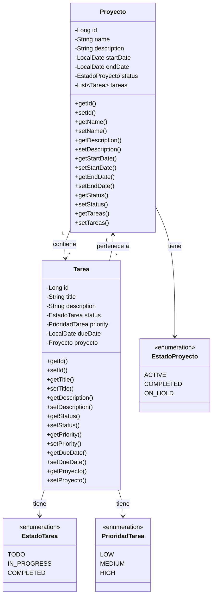
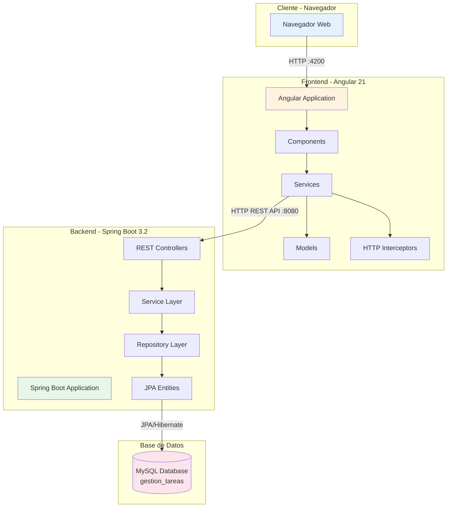
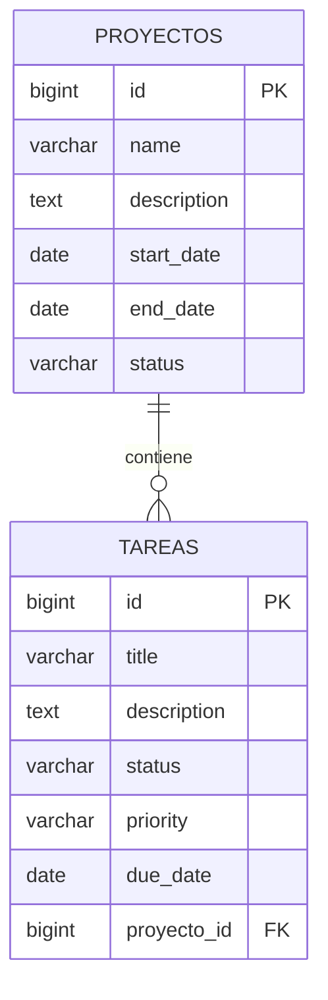

# Diagramas UML - Sistema de Gestión de Tareas y Proyectos

## 1. Diagrama de Clases - Backend

## 2. Diagrama de Arquitectura del Sistema

## 3. Diagrama de Base de Datos (Modelo Entidad-Relación)

## Tecnologías Utilizadas

- **Frontend**: Angular 21, Angular Material, TypeScript, RxJS
- **Backend**: Spring Boot 3.2, Spring Data JPA, Hibernate
- **Base de Datos**: MySQL 8.0
- **Documentación**: Swagger/OpenAPI 3.0
- **Herramientas**: Maven, npm, Git

## URLs del Sistema

- **Frontend**: http://localhost:4200
- **Backend API**: http://localhost:8080/api
- **Swagger UI**: http://localhost:8080/swagger-ui.html
- **Base de Datos**: localhost:3306/gestion_tareas