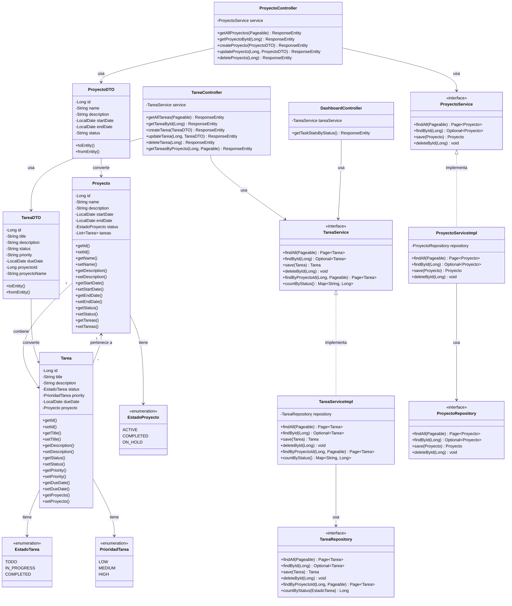
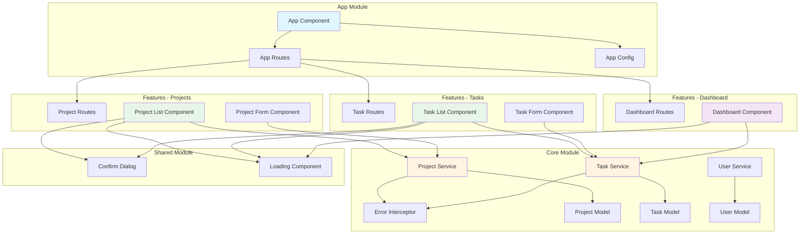
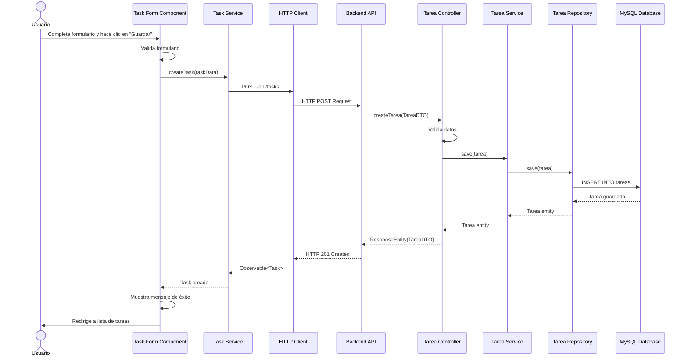
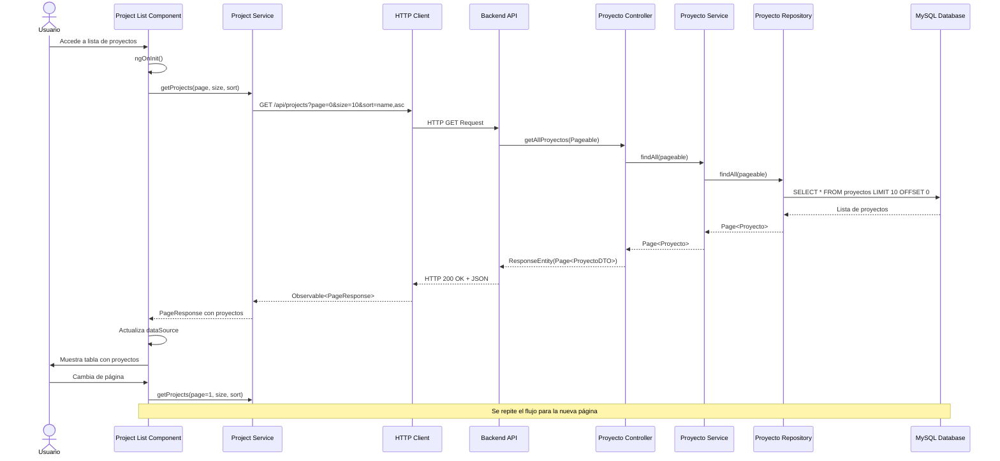
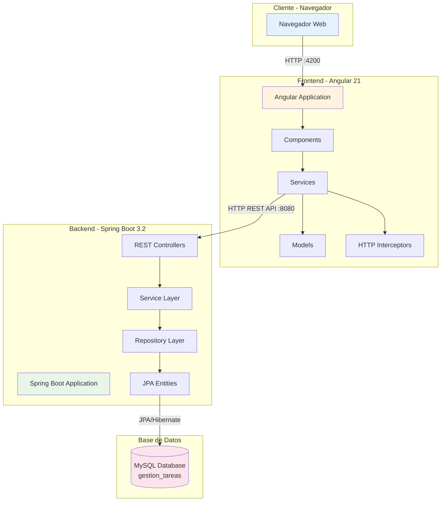
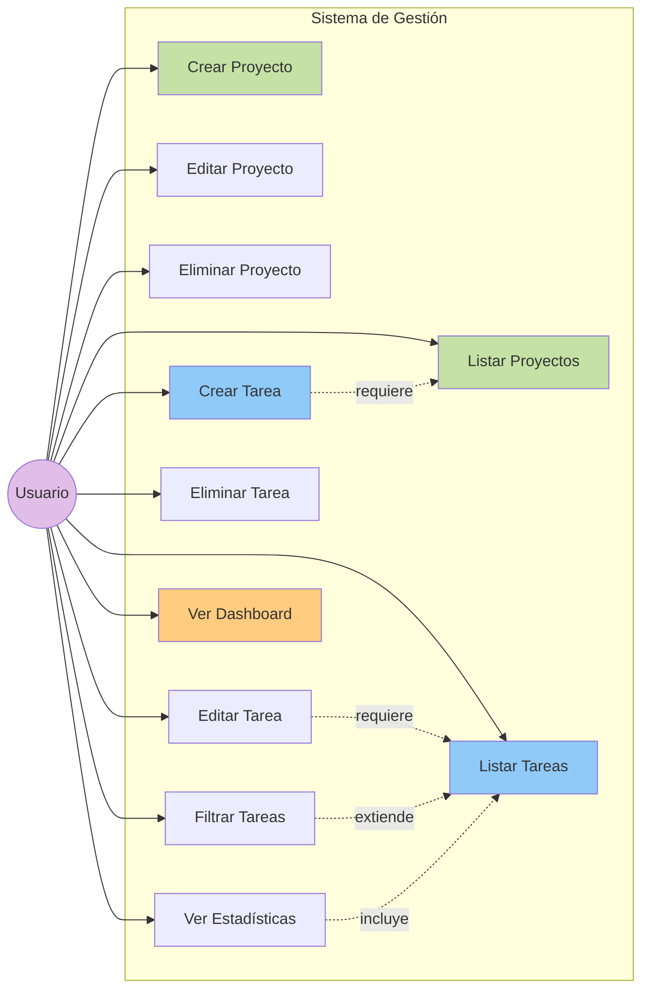
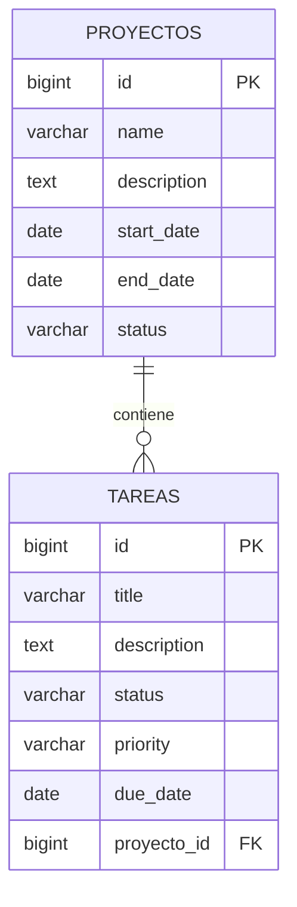
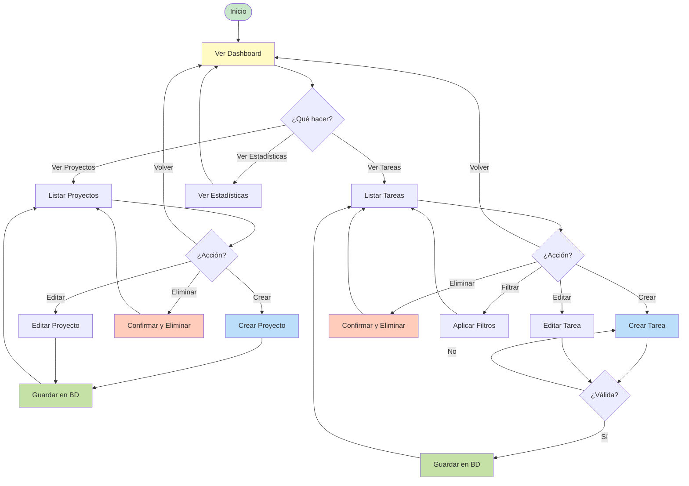
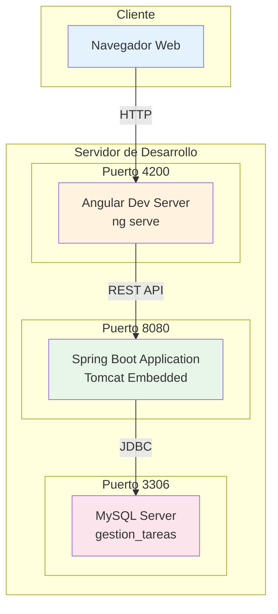
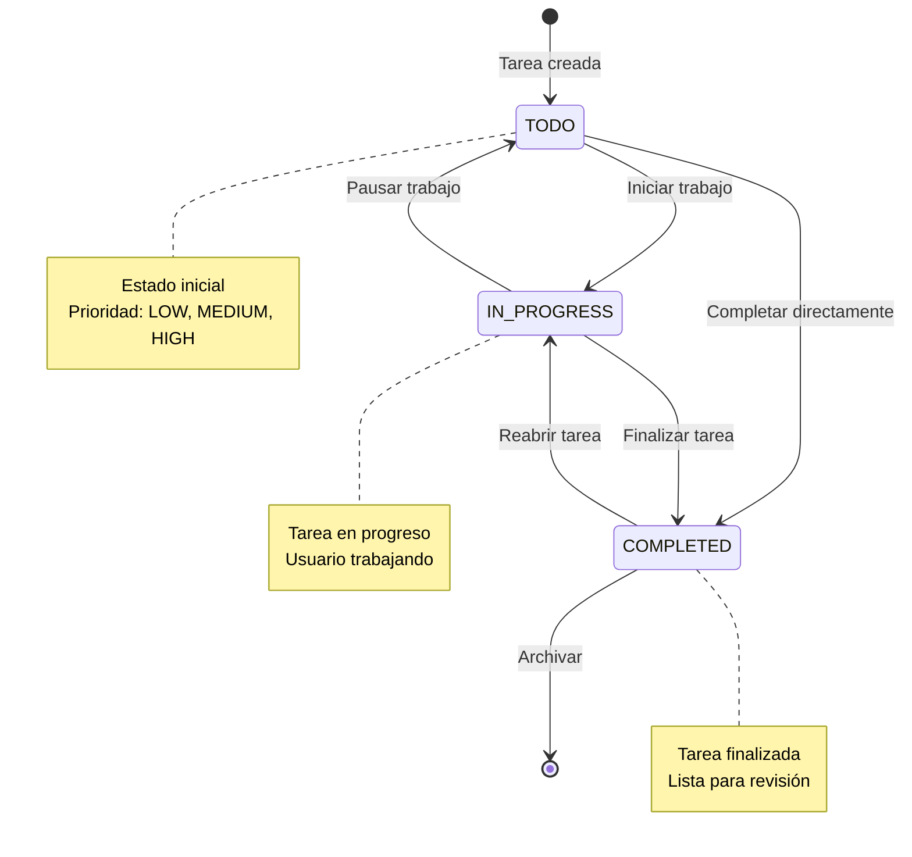

# Diagramas UML - Sistema de Gestión de Tareas y Proyectos

## 1. Diagrama de Clases - Backend

## 2. Diagrama de Componentes - Frontend Angular

## 3. Diagrama de Secuencia - Crear Tarea

## 4. Diagrama de Secuencia - Listar Proyectos con Paginación

## 5. Diagrama de Arquitectura del Sistema

## 6. Diagrama de Casos de Uso

## 7. Diagrama de Base de Datos (Modelo Entidad-Relación)

## 8. Diagrama de Flujo - Proceso de Gestión de Tareas

## 9. Diagrama de Despliegue

## 10. Diagrama de Estados - Ciclo de Vida de una Tarea

## Descripción de los Diagramas

### 1. Diagrama de Clases
Muestra todas las entidades del backend, sus relaciones, DTOs, servicios, repositorios y controladores.

### 2. Diagrama de Componentes
Representa la estructura modular del frontend Angular con sus módulos, componentes y servicios.

### 3. Diagrama de Secuencia - Crear Tarea
Flujo completo desde que el usuario crea una tarea hasta que se guarda en la base de datos.

### 4. Diagrama de Secuencia - Listar Proyectos
Muestra cómo funciona la paginación y el flujo de datos desde la BD hasta la UI.

### 5. Diagrama de Arquitectura
Vista general de las capas del sistema y cómo se comunican.

### 6. Diagrama de Casos de Uso
Todas las funcionalidades disponibles para el usuario.

### 7. Diagrama de Base de Datos
Modelo entidad-relación de las tablas MySQL.

### 8. Diagrama de Flujo
Proceso completo de gestión de tareas y proyectos.

### 9. Diagrama de Despliegue
Configuración de servidores y puertos en desarrollo.

### 10. Diagrama de Estados
Ciclo de vida de una tarea con sus transiciones de estado.

---

## Tecnologías Utilizadas

- **Frontend**: Angular 21, Angular Material, TypeScript, RxJS
- **Backend**: Spring Boot 3.2, Spring Data JPA, Hibernate
- **Base de Datos**: MySQL 8.0
- **Documentación**: Swagger/OpenAPI 3.0
- **Herramientas**: Maven, npm, Git

## URLs del Sistema

- **Frontend**: http://localhost:4200
- **Backend API**: http://localhost:8080/api
- **Swagger UI**: http://localhost:8080/swagger-ui.html
- **Base de Datos**: localhost:3306/gestion_tareas
